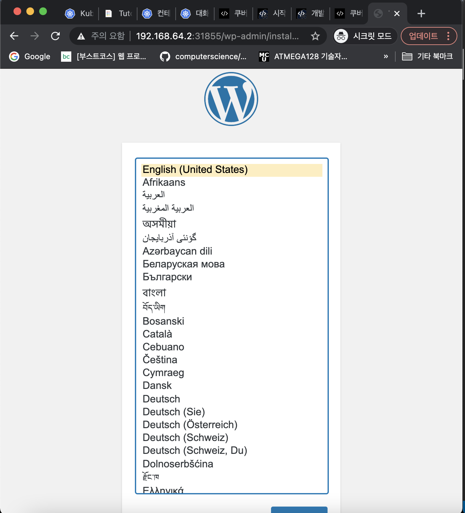

## 기본 테스트

- 쿠버네티스(minikube) 설치
- kubectl 설치.

## minikube
- 모든 기능을 테스트 하긴 어렵지만... 기본 기능을 익히기엔 충분하다.

```sh
# minikube 상태확인
minikube status

# minikube 실행
minikube start

# 특정 k8s 버전 실행
minikube start --kubernetes-version=v1.20.0

# 특정 driver 실행
minikube start --driver=virtualbox --kubernetes-version=v1.20.0

# minikube ip 확인 (접속테스트시 필요)
minikube ip

# minikube 종료
minikube stop

# minikube 제거
minikube delete
```

### 워드프레스 배포

- 도커 컴포즈를 사용했었다면 다음과 같이 배포했을 것

```yml
version: "3"

services:
  wordpress:
    image: wordpress:5.5.3-apache
    environment:
      WORDPRESS_DB_HOST: mysql
      WORDPRESS_DB_PASSWORD: password
    ports:
      - "30000:80"

  mysql:
    image: mysql:5.6
    environment:
      MYSQL_ROOT_PASSWORD: password
```

- 다음은 쿠버네티스를 이용해 배포해보자 !

```ym;
apiVersion: apps/v1
kind: Deployment
metadata:
  name: wordpress-mysql
  labels:
    app: wordpress
spec:
  selector:
    matchLabels:
      app: wordpress
      tier: mysql
  template:
    metadata:
      labels:
        app: wordpress
        tier: mysql
    spec:
      containers:
        - image: mysql:5.6
          name: mysql
          env:
            - name: MYSQL_ROOT_PASSWORD
              value: password
          ports:
            - containerPort: 3306
              name: mysql

---
apiVersion: v1
kind: Service
metadata:
  name: wordpress-mysql
  labels:
    app: wordpress
spec:
  ports:
    - port: 3306
  selector:
    app: wordpress
    tier: mysql

---
apiVersion: apps/v1
kind: Deployment
metadata:
  name: wordpress
  labels:
    app: wordpress
spec:
  selector:
    matchLabels:
      app: wordpress
      tier: frontend
  template:
    metadata:
      labels:
        app: wordpress
        tier: frontend
    spec:
      containers:
        - image: wordpress:5.5.3-apache
          name: wordpress
          env:
            - name: WORDPRESS_DB_HOST
              value: wordpress-mysql
            - name: WORDPRESS_DB_PASSWORD
              value: password
          ports:
            - containerPort: 80
              name: wordpress

---
apiVersion: v1
kind: Service
metadata:
  name: wordpress
  labels:
    app: wordpress
spec:
  type: NodePort
  ports:
    - port: 80
  selector:
    app: wordpress
    tier: frontend
```

- 이후 다음 명령어 실행

```sh
# wordpress-k8s.yml 설정 적용
kubectl apply -f wordpress-k8s.yml
# 현재 상태 확인
kubectl get all
```

- 결과

```console
(base)  gimsehwan@MacBook-Pro-2  ~/k8s/guide/index   master  kubectl get all                   
NAME                                  READY   STATUS    RESTARTS   AGE
pod/balanced-5744b548b4-9vz2n         1/1     Running   1          22m
pod/hello-minikube-6ddfcc9757-bv75t   1/1     Running   1          23m
pod/wordpress-5f59577d4d-v8wmb        1/1     Running   0          80s
pod/wordpress-mysql-545d9c6dc-xkzks   1/1     Running   0          80s


NAME                      TYPE           CLUSTER-IP      EXTERNAL-IP   PORT(S)          AGE
service/balanced          LoadBalancer   10.100.235.99   <pending>     8080:30965/TCP   22m
service/hello-minikube    NodePort       10.97.30.168    <none>        8080:30698/TCP   23m
service/kubernetes        ClusterIP      10.96.0.1       <none>        443/TCP          27m
service/wordpress         NodePort       10.104.190.41   <none>        80:31855/TCP     80s
service/wordpress-mysql   ClusterIP      10.109.88.2     <none>        3306/TCP         80s


NAME                              READY   UP-TO-DATE   AVAILABLE   AGE
deployment.apps/balanced          1/1     1            1           22m
deployment.apps/hello-minikube    1/1     1            1           23m
deployment.apps/wordpress         1/1     1            1           80s
deployment.apps/wordpress-mysql   1/1     1            1           80s

NAME                                        DESIRED   CURRENT   READY   AGE
replicaset.apps/balanced-5744b548b4         1         1         1       22m
replicaset.apps/hello-minikube-6ddfcc9757   1         1         1       23m
replicaset.apps/wordpress-5f59577d4d        1         1         1       80s
replicaset.apps/wordpress-mysql-545d9c6dc   1         1         1       80s

```

- `minikube ip`

```console
(base)  gimsehwan@MacBook-Pro-2  ~/k8s/guide/index   master ●  minikube ip    
192.168.64.2
```

- 아이피도 확인했겠다. 접속해보자



- 성공!!


- 마지막으로 리소스 제거

```sh
kubectl delete -f wordpress-k8s.yml
```